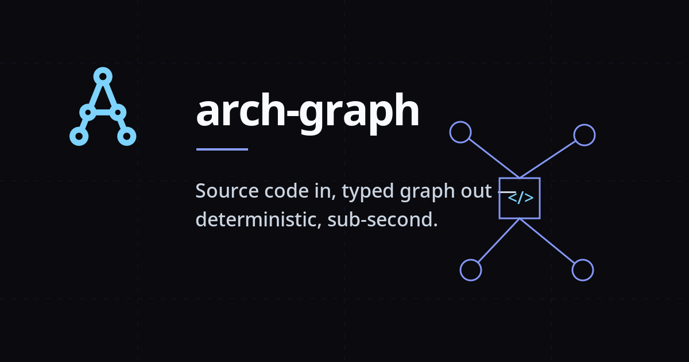

<p align="center">
  <a href="https://roman-dubovik.github.io/arch-graph/">
    
  </a>
</p>

<p align="center">
  <strong>🌐&nbsp;<a href="https://roman-dubovik.github.io/arch-graph/">roman-dubovik.github.io/arch-graph</a></strong>
  &nbsp;·&nbsp;
  <a href="#install">Install</a>
  &nbsp;·&nbsp;
  <a href="#whats-new-may-2026">What's new</a>
  &nbsp;·&nbsp;
  <a href="docs/comparisons/2026-05-17-arch-graph-vs-graphify-eval.md">Benchmarks</a>
  &nbsp;·&nbsp;
  <a href="bench/REPRODUCE.md">Reproduce</a>
  &nbsp;·&nbsp;
  <a href="bench/self-build/README.md">Self-build mini-bench</a>
</p>

<p align="center">
  <em>Static architecture graph + local multilingual semantic search for NestJS monorepos.<br>
  Deterministic. Benchmarked. Zero LLM tokens on build AND query.</em>
</p>

---

# arch-graph

## What's new (May 2026)

Fifteen features shipped on `main` in May 2026:

- **`doc-section-v1`** — Markdown files are now indexed as first-class `doc-section` graph nodes alongside code, enabling semantic search over your project's documentation.
- **`code-vs-docs-v1`** — Semantic search splits into `code_search` and `docs_search` MCP tools, eliminating the dilution effect where docs crowded out code results (measured: A_find recall 80% → 30% → 70%).
- **`ui-uplift-v1`** — fe-component snippet now includes a `classes: <Tailwind tokens>` block and i18n strings appended to embed-text, improving UI-component retrieval accuracy.
- **`openapi-enrich-v1`** — OpenAPI YAML enrichment for endpoint nodes; route descriptions and parameter summaries are folded into the semantic embedding.
- **`fe-i18n-multi-enum-v1`** — Multi-file locale support (`locales/<lang>/<feature>.json`) and TS enum-member resolution in `@Controller` path templates.
- **`closing-tails-v1`** — module recall raised to 100% across all 3 reference projects via excluded-denominator fix.
- **`snippet-fix-all-kinds-v1`** — snippet extraction now works for every node kind (provider, service, controller, fe-component, etc.).
- **`init-strategy-v1`** — installer wizard prompts for semantic strategy (`both-buckets` / `fallback`) and writes it to the project's `CLAUDE.md`.
- **`e5-base-default-v1`** *(2026-05-18)* — embedder swapped MiniLM → `multilingual-e5-base` (768-dim, passage/query prefixes). **Aggregate recall 67% → 75% (+8pp)** on 103-query bench across 3 NestJS monorepos; **C_ui 36% → 82% (+46pp)** confirms embedder was the bottleneck. Per-project: project-a 79%, project-b 82%, project-c 56%. Ships together with **incremental re-embed** (typical commit ~5–19 s, ×31–×128 speedup vs full rebuild) and **hook default-on** for auto-rebuild. Registry narrowed to `minilm | e5-base`; `bge-m3` and `arctic-m` aliases removed (explored, not adopted). See [`docs/comparisons/2026-05-18-embedder-evaluation.md`](docs/comparisons/2026-05-18-embedder-evaluation.md).
- **`cron-v1`** *(2026-05-19)* — new extractor for `@nestjs/schedule` decorators (`@Cron`, `@Interval`, `@Timeout`) and `SchedulerRegistry.add*` dynamic registrations. New NodeKind `cron-schedule` with `expression` / `resolvedExpression` / `humanReadable` meta + new EdgeKind `cron-triggers`. Surfaces «what runs on a schedule?» semantic queries. Validated on project-b (2 sites extracted: `daily-report-job`, `weekly-cleanup-job`). 33 new tests; 3 review rounds.
- **`bullmq-extras-v1`** *(2026-05-19)* — BullMQ Phase 1 extras: queue meta (`concurrency`, `defaultDelay/Attempts/Backoff`, `hasRepeat`) + new edges `queue-fails-into` (DLQ heuristic) and `queue-event-listener`.
- **`bullmq-types-v1`** *(2026-05-19)* — BullMQ Phase 2: `--with-types` flag resolves `Job<DataType>` generics via ts-morph type-checker; worker factory env-fallback concurrency; cross-enrichment `queue.add(repeat: cron)` → `cron-schedule` node + edge `queue-repeat`.
- **`bullmq-realworld-v1`** *(2026-05-19)* — Real-world recall fixes for modern `@nestjs/bullmq` patterns: `WorkerHost.process()` detection (Pass 2 + heritage type-arg Pass 3 for `class extends BaseWorkerHost<T,R>`); `NumericConstIndex` resolves `parseInt(process.env.X ?? 'N', 10)` env-fallback consts at decl level; aliased `Job` import detection via type-checker. Plus 5 new BullMQ eval queries.
- **`bullmq-realworld-v2`** *(2026-05-19)* — Closes 2-level inheritance gap in heritage type-arg detection: classes like `EmailMarketingProcessor extends BaseEmailProcessor extends BaseWorkerHost<T,R>` now resolve job-data type via recursive heritage walk. project-b real-world recall: jobData 6/8 → **8/8**.
- **`bullmq-realworld-v3`** *(2026-05-19)* — Inject BullMQ default concurrency (`1`) with explicit `concurrencySource: 'bullmq-default'` marker when @Processor has no concurrency option. project-b concurrency recall: 5/8 → **8/8 (100%)**. Discriminator preserves data fidelity — extracted values carry no source marker, inferred defaults do.

Plus a refreshed head-to-head benchmark on 103 fuzzy-intent queries vs graphify with **e5-base default + full LLM rebuild on graphify side + scope correction** (`bench-2026-05-19` tag): arch-graph **74.8% / 75.4%** (RU / EN strict) vs graphify **20.4% / 56.5%** — **+54.4 pp RU** (multilingual win) and **+18.9 pp EN strict** (semantic vs BFS-keyword). Prior graphify lenient numbers were inflated by `.next/` / `.worktrees/` / `tmp/` noise nodes the default graphify scan picked up; arch-graph excludes them by convention via `appsGlob`/`libsGlob`. See [`docs/comparisons/2026-05-19-arch-graph-vs-graphify-eval.md`](docs/comparisons/2026-05-19-arch-graph-vs-graphify-eval.md), [`bench/REPRODUCE.md`](bench/REPRODUCE.md) and [`bench/self-build/README.md`](bench/self-build/README.md).

---

**Static architecture graph for NestJS monorepos.** Extracts NATS pub/sub, BullMQ queues, TypeORM (`@InjectRepository` → `@Entity` and `@ManyToOne` / `@OneToMany` / `@ManyToMany` / `@OneToOne` → `db-relation`), NestJS module DI (modules / providers / exports / controllers + `@UseGuards` / `@UseInterceptors` / `@UsePipes`), HTTP inter-service calls, and TypeScript imports (static + dynamic + CommonJS `require`) into a single typed graph at `arch-graph-out/graph.json`. Plus an import-cycle diagnostic across `ts-import` / `lib-usage` / `di-import` edges in `diagnostics.cycles`. Designed so an LLM agent can answer "who publishes on this subject?", "what guards run on this endpoint?", or "what tables relate to entity X?" without grepping or guessing.

**Local multilingual semantic search runs alongside, fully offline.** A dense-vector index over node `embed-text` powers `semantic_search` / `code_search` / `docs_search` MCP tools. Multilingual embedder (`Xenova/multilingual-e5-base`, 768-dim, passage/query prefixes) via `transformers.js` — no API key, no GPU, no network. Russian, English, mixed queries hit the same index. **Zero LLM tokens on both build and query.**

Sister project: **[graphify](https://github.com/safishamsi/graphify)** is a generic semantic-graph tool (papers, docs, code, mixed media) that uses LLM subagents at build time to extract relationships. arch-graph is the deterministic end of the trade-off — it knows NestJS / NATS / BullMQ / TypeORM directly via `ts-morph`, with zero LLM tokens at build, plus a local multilingual semantic layer on top. The per-build recall gate enforces ≥ 95% recall (≥ 80% for TS imports) against ground truth derived from your own code; any regression below those floors fails `arch-graph build --strict`. Head-to-head benchmark: RU 67% vs 35% (multilingual handling), EN-keyword strict 53.6% vs 56.5% (near tie under apples-to-apples scoring). Both tools are local-first; the difference is graphify needs LLM subagents to build the graph, arch-graph does not.

## Install

One command — clones into `~/.arch-graph`, installs deps, symlinks `arch-graph` onto your `PATH`, and asks whether to initialise the current directory:

```sh
curl -fsSL https://roman-dubovik.github.io/arch-graph/install.sh | sh
```

If you say **yes** at the init prompt, the installer chains straight into `arch-graph init` — an interactive wizard that writes `arch-graph.config.ts`, optionally installs the Claude Code skill, optionally adds a git pre-push hook, and runs the first build right away. If you say **no**, you get a hint with the exact command to run later in your project directory, plus a `.gitignore` reminder for `arch-graph-out/`.

**Prefer to read the script before piping it to `sh`?** Same script, two commands:

```sh
git clone https://github.com/roman-dubovik/arch-graph ~/.arch-graph
bash ~/.arch-graph/scripts/install.sh
```

The installer symlinks `arch-graph` into `~/.local/bin/` (or `ARCH_GRAPH_BIN_DIR` if set). Honors `ARCH_GRAPH_GIT` and `ARCH_GRAPH_HOME` for alternate locations.

**Manual fallback:**

```sh
git clone <repo> ~/.arch-graph
cd ~/.arch-graph
npm install
mkdir -p ~/.local/bin
ln -s ~/.arch-graph/bin/arch-graph ~/.local/bin/arch-graph
# make sure ~/.local/bin is on PATH
```

Requires **Node ≥ 20**. The CLI runs through `tsx` — no `tsc` build step needed.

Verify:

```sh
arch-graph --help
```

**Uninstall:**

The interactive teardown wizard walks you through every scope (project / MCP / global):

```sh
arch-graph uninstall          # interactive TTY wizard — recommended
```

**How does it know which projects to clean?** A small registry at `$ARCH_GRAPH_REGISTRY` (override), else `$XDG_STATE_HOME/arch-graph/registry.json` (default `~/.local/state/arch-graph/registry.json`). It's updated by `arch-graph init`, `arch-graph claude install`, and `arch-graph hook install` — every entry-point that touches a project. The wizard reads the registry, shows per-project inventory, and lets you clean every known project in one shot. Entries auto-prune when their directory disappears.

**Safety:**
- Multi-project sweep on non-TTY (CI / `--yes`) requires explicit `--all-projects` — otherwise the wizard refuses and points you at `--repo .` for single-project mode. This is a guard against scripts that upgraded from older versions where `arch-graph uninstall --yes` was a single-project operation.
- `arch-graph-out/` is only flagged for removal if it contains `graph.json` (our own output) — a coincidentally-named directory in an unrelated project won't be touched.
- Global removal refuses to run unless the install dir contains a `package.json` with `"name": "arch-graph"` — guards against a misconfigured `ARCH_GRAPH_HOME` pointing at $HOME.
- If you ran `arch-graph init` before the registry existed, run `arch-graph uninstall --repo .` from inside the project to clean it (one-time per pre-registry project).

Single-project mode (skips the registry, only touches `--repo`):

```sh
arch-graph uninstall --repo /path/to/some-project --project --yes
```

Non-interactive scope flags (for CI or scripts):

```sh
arch-graph uninstall --project --all-projects    # all known projects: config / out / CLAUDE.md / hook
arch-graph uninstall --mcp                       # MCP entries in ~/.claude.json
arch-graph uninstall --global                    # ~/.arch-graph + symlink + global skill
arch-graph uninstall --all --all-projects        # everything above
arch-graph uninstall --yes --all-projects        # auto-pick scopes that have anything to remove
```

`--all-projects` is required whenever the registry has ≥2 projects and we're running non-interactively. With 0 or 1 registered projects, you can omit it.

Without flags on a non-TTY (CI pipe), it prints an inventory and exits with no side effects — dry-run by default.

Standalone shell-only fallback (no node needed, removes only global install):

```sh
bash ~/.arch-graph/scripts/uninstall.sh --yes
```

## Quick start

```sh
cd path/to/your/nestjs-monorepo
arch-graph init
```

`arch-graph init` is an interactive wizard. It asks a series of questions with sensible defaults, writes `arch-graph.config.ts`, and optionally chains: Claude Code integration install, git hook install, and a first build — all in one command.

Sample session:

```
arch-graph init — interactive setup wizard

? Project id (used as service:<id> prefix) [my-project]: my-project
? Repo root [.]:
? Apps glob (where services live) [apps/*]:
? Libs glob [libs/**]:

? Which domains to extract?
  1. [x] NATS          pub/sub + request/reply
  2. [x] TypeORM       @InjectRepository → @Entity
  3. [x] BullMQ        @InjectQueue / @Processor
  4. [x] NestJS DI     @Module imports/providers/exports
  5. [x] HTTP          HttpService / axios / fetch
  6. [x] TS imports    file→file / service→lib

  Disable any? Enter numbers separated by comma (blank = all enabled):

? Custom NATS wrapper API? (you wrap @nestjs/microservices in your own class) [y/N]: n

? Install Claude Code integration (./CLAUDE.md + skill)? [Y/n]:

? Install git hook?
  1. pre-commit   (graph committed with code) — recommended
  2. post-commit  (graph rebuilt after commit, not in commit)
  3. none
  Choice [1]:

? Strict mode? (fail build if recall drops below domain floor — useful for CI) [y/N]:

? Run first build now? [Y/n]:

✓ wrote arch-graph.config.ts
✓ wrote CLAUDE.md
✓ pre-commit hook installed
... running first build ...
✓ build complete: 847 nodes, 3241 edges
✓ wrote arch-graph-out/
```

Non-interactive (CI) fallback: when stdin is not a TTY, `arch-graph init` writes a template config without asking any questions.

## What you get

| Domain | Coverage (what the extractor recognises) | Per-build recall gate | Measured on our 5 reference NestJS monorepos |
|---|---|---|---|
| **NATS** | publish + subscribe via decorators and configurable wrapper APIs; literal + pattern + dynamic subject resolution | recall ≥ 95% (handlers + senders independent) | 100% recall, 5/5 |
| **TypeORM** | `@InjectRepository(Entity)` → `@Entity` resolution across services / libs | recall ≥ 95% + resolveRate ≥ 95% | 100% / 100%, 5/5 |
| **BullMQ** | `@InjectQueue` producers, `@Processor` consumers, `BullModule.registerQueue` registrations; queue meta (`concurrency`, `defaultDelay/Attempts/Backoff`, `hasRepeat`, `jobData[]`, `workerConcurrencyEnvVar`/`Fallback`); EdgeKinds `queue-fails-into` (DLQ heuristic), `queue-event-listener`, `queue-repeat` (→ cron-schedule). Modern `@nestjs/bullmq` patterns: `WorkerHost.process()` override + heritage type-args (`extends BaseWorkerHost<T,R>`) including 2-level inheritance. `--with-types` flag enables Job<T> resolution via ts-morph. `concurrencySource: 'bullmq-default'` marker distinguishes inferred-from-framework defaults from extracted values. | recall ≥ 95% per role + resolveRate ≥ 95% | 100% / 100%, 5/5; project-b real-world: jobData 8/8, concurrency 8/8 (5 code + 3 default) |
| **Cron schedule** | `@nestjs/schedule` decorators (`@Cron`, `@Interval`, `@Timeout`) plus dynamic `SchedulerRegistry.add*` registrations. Resolves `CronExpression.X` aliases to literal cron strings. NodeKind `cron-schedule` + EdgeKind `cron-triggers`. Per-site diagnostics (`unresolved`, `unresolvedOptions`, `filteredByReceiver`). | recall ≥ 95% per pattern | 100%, project-b: 2 sites (`daily-report-job`, `weekly-cleanup-job`) |
| **NestJS DI** | `@Module({ imports, providers, exports, controllers })` with full reference resolution | recall ≥ 95% per field + resolveRate ≥ 95% | 100% / 98.7–100%, 5/5 |
| **HTTP** | `HttpService` / `axios` / `fetch` call sites with URL classification (literal / env-ref / pattern / unresolved → internal service vs external host) | recall ≥ 95% | 100%, 5/5 |
| **TS imports** | static + dynamic `import` sites resolved through `tsconfig.paths`; aggregated service → lib `lib-usage` edges (and optional file-level `ts-import` edges) | recall ≥ 80% (alias resolution is best-effort) | 100%, 5/5 |

"Coverage" is whether an extractor exists for the domain (boolean per row). The recall gate runs on every build against ground truth derived from *your* code — that's what tells you arch-graph is matching reality on the monorepo in front of it. The last column is what we measured against our private reference suite; your numbers depend on how closely your code follows NestJS conventions and what wrapper APIs are declared in `arch-graph.config.ts`.

Each domain emits structured diagnostics for everything it couldn't pin down — dynamic subjects, unresolved queue names, opaque HTTP URLs, missing entity decorators. That list is the honest gap report.

## Build output

`arch-graph build` writes four files to `arch-graph-out/`:

- `graph.json` — nodes + typed edges
- `diagnostics.json` — every unresolved / dynamic call-site with source location
- `validation.json` — per-domain recall, resolveRate, and ground-truth counts
- `graph.mermaid` — full flowchart (add `--mermaid-slice=per-service` or `--mermaid-slice=domain:nats` for focused views)

After each build, the per-domain table is printed to stdout:

```
Domain       Recall  Resolve   Floor   Status
──────────────────────────────────────────────────────────────────────
nats         100.0%      n/a  ≥95.0%   ✓ ok
typeorm      100.0%   100.0%  ≥95.0%   ✓ ok
bullmq       100.0%   100.0%  ≥95.0%   ✓ ok
di           100.0%    98.7%  ≥95.0%   ✓ ok
http         100.0%      n/a  ≥95.0%   ✓ ok
imports      100.0%      n/a  ≥80.0%   ✓ ok
```

If a domain falls below its recall floor the status shows `⚠` with tips. By default `arch-graph build` is **advisory** — it always exits 0 so it never breaks builds unexpectedly. Use `--strict` for CI hard-fail:

```sh
arch-graph build               # advisory: always exit 0, prints table
arch-graph build --strict      # CI: exit 3 if any domain drops below floor
arch-graph build --quiet       # suppress table (used by the pre-commit hook)
```

## CLAUDE.md integration

Make arch-graph always-on in Claude Code sessions:

```sh
arch-graph claude install --skill
```

This writes a delimited section into `./CLAUDE.md` telling Claude to query the graph before answering architecture questions, and installs `~/.claude/skills/arch-graph/SKILL.md` so the `/arch-graph` skill becomes available globally. Re-running is idempotent — it replaces the previous block in place.

```sh
arch-graph claude uninstall   # remove the section
arch-graph install-skill      # install the skill file separately, any time
```

### Semantic search strategy

During `arch-graph init`, the wizard asks you to choose an agent-side semantic search strategy:

- **both-buckets** (default, recommended) — `code_search` and `docs_search` are called in parallel on every retrieval, giving the LLM the richest context (~$0.005/query on Sonnet, ~$0.025/query on Opus).
- **fallback** — `code_search` runs first; `docs_search` is only called on a miss. Halves cost for cost-sensitive projects (~$0.003/query on Sonnet, ~$0.012/query on Opus). Recall is identical to `both-buckets`.

The choice is persisted as a `## arch-graph semantic search strategy` section. If no `CLAUDE.md` exists (or the user declines to append), it is written to `CLAUDE.md.arch-graph-snippet.md` in the project root. If a `CLAUDE.md` is already present, the wizard asks whether to append to it or create the separate file. To change the strategy later, edit that file or re-run `arch-graph init`.

## Git hook

The pre-commit hook (default) rebuilds the graph before each commit that touches `.ts` files and **auto-stages** the output artifacts (`graph.json`, `diagnostics.json`, `validation.json`, `graph.mermaid`) so the graph is always coherent with the code in history.

```sh
arch-graph hook install                        # pre-commit (default, recommended)
arch-graph hook install --mode=post-commit     # post-commit: rebuilds after commit
arch-graph hook status                         # check installed mode
arch-graph hook uninstall                      # remove
```

**Why pre-commit is usually better:** the graph is committed alongside the code that generated it, so every checkout in history is self-consistent. Post-commit rebuilds the graph after the commit has landed — the graph in the commit is one build behind until the hook fires.

The hook is a marker-delimited block. If you already have a hook from another tool, arch-graph appends to it without disturbing existing content. Switching modes strips the old block and writes the new one.

Build errors (config parse, I/O) block the commit. Recall-floor regressions are advisory by default — add `arch-graph build --strict` to the hook body manually if you want CI-style gating pre-commit.

## Query subcommands

Ten CLI commands let you interrogate the graph directly — faster than MCP and more structured than raw `jq`:

| Subcommand | Input | What it returns |
|---|---|---|
| `who-publishes <subject>` | NATS subject | services that publish on it |
| `who-subscribes <subject>` | NATS subject | services that subscribe |
| `queue-producers <queue>` | BullMQ queue name | services that enqueue jobs |
| `queue-consumers <queue>` | BullMQ queue name | services that process jobs |
| `table-users <table>` | TypeORM table name | services with repository access |
| `deps-of <service-id>` | service id | outgoing dependencies by kind |
| `dependents-of <service-id>` | service id | services that depend on this one |
| `module-imports <module>` | NestJS module class | what the module imports |
| `path <from> <to>` | two node ids | shortest directed path |
| `stats` | — | node + edge counts per kind |

Options: `--out <dir>` (default `./arch-graph-out`), `--json` (default), `--table`.
Exit codes: `0` = found, `4` = not found, `1` = bad args / I/O error.

Sample:

```sh
arch-graph who-publishes user.created --table
```

```
role       owner         counterpart    kind          file                     line
---------  ------------  -------------  ------------  -----------------------  ----
publisher  my-api        user.created   nats-publish  apps/api/user.service.ts  42
```

The Claude Code skill calls these subcommands automatically when answering architecture questions — it's cheaper than an MCP round-trip and requires no running server.

## Semantic search (optional)

The above commands answer **deterministic structural questions** — "who publishes on this subject?" — using exact edge traversal. For fuzzy intent like "find code about X" or "how does authentication work?", arch-graph optionally adds **semantic dense-vector search** over node embeddings.

The semantic layer is independent and opt-in: arch-graph works identically well without it. If you enable it, the CLI and MCP server gain new tools:

- **Model**: `Xenova/multilingual-e5-base` (768-dimensional, multilingual, passage/query prefixes). The model name is recorded in `manifest.json` so any external consumer (a second tool, a future agent, a federated index) can verify vector compatibility before mixing results.
- **How it works**: each GraphNode (service, module, table, queue, **doc-section**) gets a dense vector computed from `label + kind + AST snippet` (or Markdown section text for doc-section nodes), persisted in a sidecar at `arch-graph-out/<repo>/semantic/`. Markdown files matching the `docs` include globs (including root-level `*.md` by default) are indexed automatically.
- **Quick start**: 
  ```sh
  arch-graph semantic build              # one-time: downloads model (~280 MB, cached), extracts snippets, embeds
  arch-graph semantic search "auth flow" # fuzzy search for top 10 results
  arch-graph semantic search "logging" --k 20 --json  # top 20, structured output
  ```
- **First build**: the model downloads ~280 MB on first run and is cached under `~/.cache/transformers/` (or via `HF_HOME` env var), so subsequent `semantic build` and `semantic search` run much faster. After the first `semantic build`, subsequent builds are incremental (~1-2 s per typical commit). The pre-commit hook installs with semantic auto-rebuild on by default.
- **Sidecar layout**: `arch-graph-out/<repo>/semantic/{manifest.json, embeddings.jsonl}` — one JSON record per line, streamable for large graphs.
- **MCP tools**: when the MCP server is running (`arch-graph mcp`), three semantic tools become available:
  - `semantic_search` — mixed bucket (code + docs together)
  - `code_search` — code nodes only (excludes `doc-section`)
  - `docs_search` — doc-section only (Markdown sections)

  Splitting into two buckets removes the dilution effect: when docs are in the same index as code, doc-section nodes can crowd out the relevant code nodes for "find X" queries (measured: A_find recall dropped 80% → 30% on project-a; restored to 70% with `code_search`).

  **Recommended agent pattern (default): `both-buckets`** — call `code_search` and `docs_search` in parallel for every retrieval. The LLM gets two labeled top-K lists and picks what's useful. Doubles retrieval cost (~$0.005/query on Sonnet, ~$0.025/query on Opus) but eliminates intent-routing risk.

  **Override per-project**: write in the project's `CLAUDE.md`:

  ```markdown
  ## arch-graph search strategy

  Use the **fallback** strategy: call `code_search` first. Only call `docs_search` if the code results don't answer the question. Halves retrieval cost; same hit-rate; agent gets less context.
  ```

  Measured hit-rate (3 projects, 103 queries): overall **47% → 67%** with split tools (both-buckets and fallback are identical on that suite). Final post-semantic head-to-head numbers vs graphify: RU **67% vs 35%** (+32pp arch-graph), EN-keyword strict **53.6% vs 56.5%** (near tie). See [`docs/comparisons/2026-05-17-arch-graph-vs-graphify-eval.md`](docs/comparisons/2026-05-17-arch-graph-vs-graphify-eval.md) for the full memo.

## MCP server

Optional — for editors with an MCP client configured:

```sh
arch-graph mcp   # starts the stdio MCP server backed by arch-graph-out/graph.json
```

Exposes 15 tools — 12 structural + 3 semantic.

**Structural (12):** `subject_publishers`, `subject_subscribers`, `queue_producers`, `queue_consumers`, `service_dependencies`, `service_dependents`, `module_imports`, `table_users`, `path`, `explain`, `query`, `stats`.

**Semantic (3, requires sidecar index):**
- `code_search` — vector search over code nodes only (services, modules, tables, queues, endpoints, fe-components). Use for "find code that does X".
- `docs_search` — vector search over `doc-section` nodes only (Markdown sections). Use for "find documentation about Y".
- `semantic_search` — mixed bucket (code + docs together). Useful as a fallback when you don't know which bucket the answer lives in, but expect lower precision on mixed corpora.

See [Semantic search](#semantic-search-optional) for setup and the recommended `both-buckets` agent pattern. For unresolved / dynamic call-sites, read `arch-graph-out/diagnostics.json` directly — there is no MCP tool for it.

The CLI query subcommands are preferred over MCP when both are available (no stdio overhead, no server lifecycle).

## Limitations & honesty

This is a **static** extractor. It does not see runtime configuration, container env values, or dynamically constructed identifiers. The following are deferred or intentionally out of scope:

- **D1** — Dynamic NATS subjects (`subject.${userId}`) are recorded as `unresolved` in `diagnostics.json`, not invented as edges.
- **D2** — gRPC / Kafka / SQS — not yet covered; only NATS + BullMQ + HTTP are wired.
- **D3** — Cross-monorepo links (multi-repo deployments). Single monorepo only today.
- **D4** — Runtime DI overrides (`{ provide: TOKEN, useFactory }` that resolves at runtime). Static analysis sees the factory call, not its output.
- **D5** — Decorator metadata from external libs that doesn't follow the NestJS conventions encoded here.
- **D6** — Inferred type-only edges. Type-level uses are not graph edges; only value-level usages are.

**Semantic search**: the default model is `Xenova/multilingual-e5-base` (768-dim, passage/query prefixes). Build time on a 30K-node monorepo is ~41 min on first run; subsequent incremental builds typically take ~1-2 s per commit. Measured recall: 75% aggregate over 103 queries on 3 NestJS monorepos; C_ui 82% (+46pp vs the previous MiniLM default). See [`docs/comparisons/2026-05-18-embedder-evaluation.md`](docs/comparisons/2026-05-18-embedder-evaluation.md) for the full evaluation.

To extend coverage, add an extractor under `src/extractors/<domain>/` and wire it into `src/pipeline/build.ts` and a `mapper/` that emits typed edges. The validation harness in `src/validation/` is the contract — every extractor must produce a ground-truth comparison that gates `arch-graph build` at the configured recall floor.

## Adjacent tools

arch-graph isn't the only graph extractor in this space, and on some questions it isn't the best one. If you're picking a tool, weigh these honestly:

- **[@nestjs/devtools-integration](https://www.npmjs.com/package/@nestjs/devtools-integration)** — official, runtime-based. Boots your app via `NestFactory.create()` and snapshots the live module/provider graph. More authoritative than any static tool on what DI actually wires up at boot (including conditional bootstrap). Different category (live runtime vs static); doesn't extract NATS subjects, BullMQ queues, or TypeORM table edges as typed edges.
- **[@riaskov/nestjs-graph-visualizer](https://www.npmjs.com/package/@riaskov/nestjs-graph-visualizer)** — static + Nest-aware, methodologically closest to arch-graph. Narrower scope: NestJS module DI only, no cross-cutting NATS / BullMQ / inter-service HTTP. Output is Mermaid / DOT / SVG, not JSON.
- **[dependency-cruiser](https://github.com/sverweij/dependency-cruiser)** — generic TypeScript import graph, battle-tested across module systems. Doesn't see NestJS semantics; all decorators collapse to plain imports. arch-graph won't dominate it on raw file-imports — we'd expect a near-tie there, and a win by construction on any NATS / BullMQ / TypeORM question dep-cruiser is structurally incapable of answering.

Honourable mentions for narrower / different categories: [nestjs-spelunker](https://github.com/jmcdo29/nestjs-spelunker) (runtime DI grapher), [nestjs-doctor](https://nestjs.doctor/docs) (lint + HTML report), [madge](https://github.com/pahen/madge) / [arkit](https://github.com/dyatko/arkit) (older / diagram-first import graphers), [scip-typescript](https://github.com/sourcegraph/scip-typescript) (code-intel refs/defs, different abstraction).

## Benchmark

Two benchmarks are committed, each measuring a different question.

**Post-semantic (current, 2026-05-17):** 103 fuzzy-intent queries × 3 NestJS monorepos, run through both tools. Live in [`docs/comparisons/2026-05-17-arch-graph-vs-graphify-eval.md`](docs/comparisons/2026-05-17-arch-graph-vs-graphify-eval.md). Two ways to read the numbers, both honest:

- **As a Russian-speaking team would experience it (RU queries):** arch-graph **67%** vs graphify **35%** (+32pp). 80%+ of the queries are in Russian; graphify does keyword-BFS over English code-node labels and returns "no matching nodes" for most non-English fuzzy queries. arch-graph's multilingual embedder (`Xenova/multilingual-e5-base`) bridges the language gap.
- **As an LLM-agent pipeline would experience it (EN-keyword queries, apples-to-apples strict scoring on 69 scoreable queries):** arch-graph **53.6%** vs graphify **56.5%** — a near tie (graphify +3pp). The 32-point RU gap is almost entirely multilingual-handling, not retrieval-quality. By category under strict EN: arch-graph leads in B_debug (+38pp) and D_docs (+20pp); graphify leads in C_ui (+50pp) and E_arch (+18pp); A_find is exact tie.
- Token cost per query: arch-graph ~1000, graphify ~350. **arch-graph uses zero LLM tokens on both build and query.** graphify uses LLM subagents at build time for semantic extraction.
- Per-query wins on the RU bench: 37 arch-graph, 4 graphify, 32 ties, 30 both-miss.

**Pre-semantic (historical, 2026-05-16):** 15-question structural-edge comparison on 5 NestJS monorepos lives in [`bench/report.md`](bench/report.md). Key finding from that run: arch-graph used **7.6× fewer LLM context tokens** than graphify (688k vs 5.2M, same `cl100k_base` encoder), with 100% vs 39% substring-presence recall. Those numbers reflect arch-graph's **structural-only** behavior before the semantic sidecar shipped; the post-semantic head-to-head above supersedes them for any question about retrieval quality.

To reproduce on your own monorepos, drop one `configs/<id>.config.ts` per project and run `bash bench/run.sh` — see `bench/README.md`. Or use `arch-graph compare` (below) to auto-generate questions from your own graph.

## Compare on your own repo

Skeptical of the numbers above? Reproduce the comparison on your own codebase:

```sh
arch-graph build                                     # build your graph
/graphify /path/to/repo                              # in Claude Code, optionally
arch-graph compare --graphify graphify-out/          # see side-by-side
```

`arch-graph compare` auto-generates 10 questions from real nodes in your graph (NATS subjects, queues, DB tables, services, modules), counts `cl100k_base` tokens for each tool's compact context, and writes a markdown report at `arch-graph-out/compare-report.md`. Without `--graphify` we auto-detect `./graphify-out/`; if nothing's found you get a graph-size-only summary plus a friendly install hint.

**Contribute your numbers.** Run `arch-graph compare --share` to generate an **anonymized** snippet (counts only — no project / subject / queue / service names) and open a pre-filled GitHub Discussion under `benchmark-contributions`. The preview is shown before anything leaves your machine. All contributions land in the [public Discussions](https://github.com/roman-dubovik/arch-graph/discussions) — they're how the multi-repo benchmark grows beyond our reference monorepos.

See `arch-graph compare --help` for flags (`--questions`, `--report`, `--quiet`, `--share`).

For deeper contributions — bringing your own evaluator suite, adding extractors, filing failure-mode issues — see [`CONTRIBUTING.md`](CONTRIBUTING.md). The custom-evaluator section walks through the `queries.json` schema, scoring criteria, and how to submit per-category hit-rates on a codebase shape we don't yet cover.

## Development

```sh
npm install
npm run dev -- build --config example.config.ts   # tsx-driven, no build step
npx tsc --noEmit                                  # typecheck
```

`configs/example.config.ts` is a starter template — copy it to `configs/<your-id>.config.ts`, point `root` at your NestJS monorepo, and pass it via `--config`.

### Integration test

Runs a full install→init→build→stats→queries→integrations flow on a synthetic NestJS fixture in a sandboxed `$TMPDIR`. Required deps: `node` and `jq`. Optional: `expect` — enables the PTY-driven test of `install.sh`'s interactive prompt (gracefully skipped when absent or when the host has no usable PTY).

```
npm run test:integration             # uses the current clone
npm run test:integration:remote      # clones from github fresh
```

## License

MIT — see [LICENSE](LICENSE).
